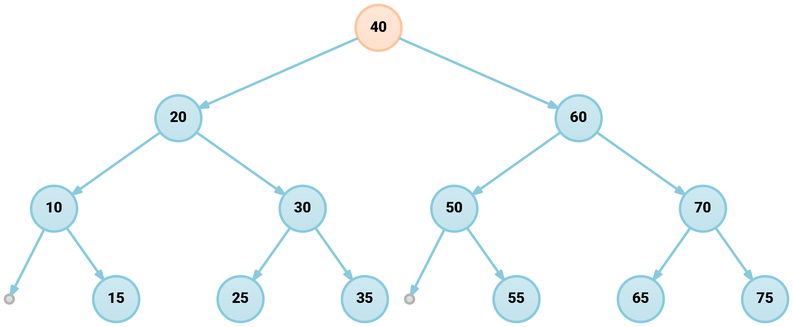

# Zadanie domowe \#3


Do oceny można zgłosić maksymalnie trzy wybrane zadania domowe.


**Nazwa repozytorium:** `AISDI-HW 3: Nazwisko`

### Treść zadania

Rozpatrujemy standardowe [drzewo wyszukiwania binarnego](https://en.wikipedia.org/wiki/Binary_search_tree), [drzewo typu splay](https://en.wikipedia.org/wiki/Splay_tree) i [drzewo AVL](https://en.wikipedia.org/wiki/AVL_tree). Proszę naszkicować kolejne stany poszczególnych drzew po każdej z wykonywanych operacji:

* wstaw kolejno wartości `51, 22, 43, 84, 35, 86, 57, 98`,
* następnie znajdź wartość `57`,
* następnie usuń kolejno wartości `57, 51`.

Schemat wywołania tych operacji wyglądałby następująco:


```cpp
#include <vector>


template<typename Key>
struct Node {
    Key key;
    // ...
};


template<typename Key>
class Tree {
    public:
        // ...
        virtual void erase(const Key& key) { /* ... */ }
        virtual Node<Key>* insert(const Key& key) { /* ... */ }
        virtual Node<Key>* find(const Key& key) const { /* ... */ }
};


template<typename Key>
class BinarySearchTree : public Tree<Key> {
    // ...
};


template<typename Key>
class SplayTree : public Tree<Key> {        
    // ...
};


template<typename Key>
class AVLTree : public Tree<Key> {        
    // ...
};


// ...
    auto bst = BinarySearchTree<int>();
    auto splay = SplayTree<int>();
    auto avl = AVLTree<int>();

    std::vector<Tree<int>*> trees{};
    trees.push_back(&bst);
    trees.push_back(&splay);
    trees.push_back(&avl);

    // Operacje wykonujemy dla każdego typu drzewa
    for (const auto& tree : trees) {
        tree->insert(51); // ...-00.pdf
        tree->insert(22); // ...-01.pdf
        tree->insert(43); // ...-02.pdf
        tree->insert(84); // ...-03.pdf
        tree->insert(35); // ...-04.pdf
        tree->insert(86); // ...-05.pdf
        tree->insert(57); // ...-06.pdf
        tree->insert(98); // ...-07.pdf
        
        tree->find(57);   // ...-08.pdf
        
        tree->erase(57);  // ...-09.pdf
        tree->erase(51);  // ...-10.pdf
    }
// ...
```


Do realizacji szkiców można wykorzystać na przykład pakiet [_**Graphviz**_](https://www.graphviz.org/) lub [_**LaTeX**_](https://www.latex-project.org/).


W ramach niniejszego zadania domowego **nie jest wymagana implementacja poszczególnych drzew**. Operacje można "policzyć" na kartce i na tej podstawie bezpośrednio przygotować szkice.


### Przykład zapisu drzewa w języku DOT \(Graphviz\)



```bash
# Basic tree in DOT format
# 
# Generate PNG file with:
# > dot -Tpng -o tree_basic.png tree_basic.dot

strict digraph dot {

	40 -> 20
	40 -> 60

	20 -> 10
	20 -> 30

	60 -> 50
	60 -> 70

}

```



```bash
# Tree in DOT format, extended with GNU M4 macros and some additional styling
#
# Styles:
# - null pointers [NULL]
# - root node [YELLOW]
# - invisible padding nodes & edges for more symmetrical binary
#   tree [INVISIBLE_N/INVISIBLE_E] 
#
# Generate PNG file with:
# > m4 tree.dot | dot -Tpng -o tree.png 

define(YELLOW, `color = "#ffc49c", fillcolor = "#ffe1cc:#ffe7d7"')
define(NULL, `label = "", width = .1, height = .1, color = "#b3b3b3", fillcolor = "#d7d7d7:#e4e4e4"')
define(INVISIBLE_E, `style = invisible, arrowsize = 0, weight = 10')
define(INVISIBLE_N, `style = invisible, label = ""')


strict digraph dot {

    graph [
        layout = dot,
        dpi = 300,
        nodesep = 0.2,
        ranksep = 0.5,
        splines = line,
        ordering = out,
    ]

    edge [
        color = "#89cadd",
        penwidth = 2,
        arrowsize = 0.7,
    ]

    node [
        style = filled,
        color = "#89cadd",
        fillcolor = "#c3e3ed:#cee9f1",
        gradientangle = 90,
        penwidth = 2,
        fontname = "Roboto Medium",
        fontsize = 12,
        shape = circle,
    ]

    # Rows

    40 [YELLOW]
    {rank=same 20, 60}
    {rank=same 10, 30, m40, 50, 70}
    {rank=same left_10, 15, m20, 25, 35, left_50, 55, m60, 65, 75}


    # NULL pointers

    left_10, left_50 [NULL]


    # Invisible padding nodes

    m40, m20, m60, m10, m30, m50, m70 [INVISIBLE_N]


    # Edges

    40 -> 20
    40 -> m40 [INVISIBLE_E]
    40 -> 60

    20 -> 10
    20 -> m20 [INVISIBLE_E]
    20 -> 30

    60 -> 50
    60 -> m60 [INVISIBLE_E]
    60 -> 70

    10 -> left_10
    10 -> m10 [INVISIBLE_E]
    10 -> 15

    30 -> 25
    30 -> m30 [INVISIBLE_E]
    30 -> 35

    50 -> left_50
    50 -> m50 [INVISIBLE_E]
    50 -> 55

    70 -> 65
    70 -> m70 [INVISIBLE_E]
    70 -> 75

}

```













### Przykład generowania szkicu drzewa za pomocą TikZ/LaTeX



```text
\documentclass[crop,tikz,10pt]{standalone}

\usepackage{xcolor}

\definecolor{background}{HTML}{F0F4F5}
\definecolor{border}{HTML}{D3E0E3}

\definecolor{blue}{HTML}{1395ba}
\definecolor{dark_blue}{HTML}{0e708c}

\definecolor{pink}{HTML}{f8216e}
\definecolor{dark_pink}{HTML}{b3174e}

\definecolor{yellow}{HTML}{f8ca00}
\definecolor{orange}{HTML}{ff8a39}

\definecolor{green}{HTML}{4fa400}
\definecolor{dark_green}{HTML}{306400}


\usepackage{tikz}
\usetikzlibrary{
    arrows,
    backgrounds,
    positioning,
}

\begin{document}

\begin{tikzpicture}[%
    scale=1.0,
    node distance=0.5cm,
    every node/.style={minimum size=0, inner sep=0},
    on grid,
    background rectangle/.style={draw=border!80!black,fill=background},
    show background rectangle,
    inner frame sep=0.5cm,
    level/.style={
        sibling distance = 5cm/#1,
        level distance = 1.5cm
    },
    every node/.style={
        font=\sffamily\footnotesize,
        circle,
        minimum size=0.6cm,
        line width=0.025cm,
        draw=blue!50,
        top color=blue!20,
        bottom color=blue!30,
    },
    root/.style={
        draw=yellow!50,
        top color=yellow!20,
        bottom color=yellow!30,
    },
    null/.style={
        minimum size=0.2cm,
        inner sep=0,
        draw=black!30,
        top color=black!10,
        bottom color=black!20,
    },
    edge from parent/.style={
        draw,
        pink,
        thick
    }
]

\clip (0, 0) rectangle (10.0, 7.0);

\node [root] at (5, 6) {40}
    child { 
        node {20}
        child {
            node {10}
            child { node [null] {} }
            child { node {15} }
        }
        child {
            node {30}
            child { node {25} }
            child { node {35} }
        }
    }
    child {
        node {60}
        child {
            node {50}
            child { node [null] {} }
            child { node {55} }
        }
        child {
            node {70}
            child { node {65} }
            child { node {75} }
        }
    }
;
 
\end{tikzpicture}
\end{document}

```









### Pomocne narzędzia

* Na stronie [v**iz-js.com**](http://viz-js.com) można poeksperymentować z zapisem w języku _DOT_ bezpośrednio w przeglądarce, bez konieczności instalacji pakietu _Graphviz_.
* [**VisuAlgo**](https://visualgo.net/en/bst) zawiera interaktywne wizualizacje drzewa BST, AVL i wielu innych struktur danych i algorytmów.
* W [**repozytorium**](https://github.com/karolpiczak-pw/2019Z-AISDI/tree/master/tutorials/homework-3-trees) przygotowałem skrypt w _Pythonie,_ który pozwala przyspieszyć generowanie wykresów za pomocą _XeLaTeX-u._

### Forma dostarczenia wyników

Proszę wgrać wynikowe pliki do repozytorium oznaczając je jednoznacznie co do kolejności \(np. `bst-00.png`, `...`, `bst-10.png`\) lub scalając w jeden obraz/PDF. Nie jest konieczne załączanie plików pomocniczych czy implementacji drzew. Do wizualizacji można wykorzystać również inne dowolne narzędzia. W ostateczności może nimi być kartka i ołówek, ale preferowane są wersje elektroniczne.


